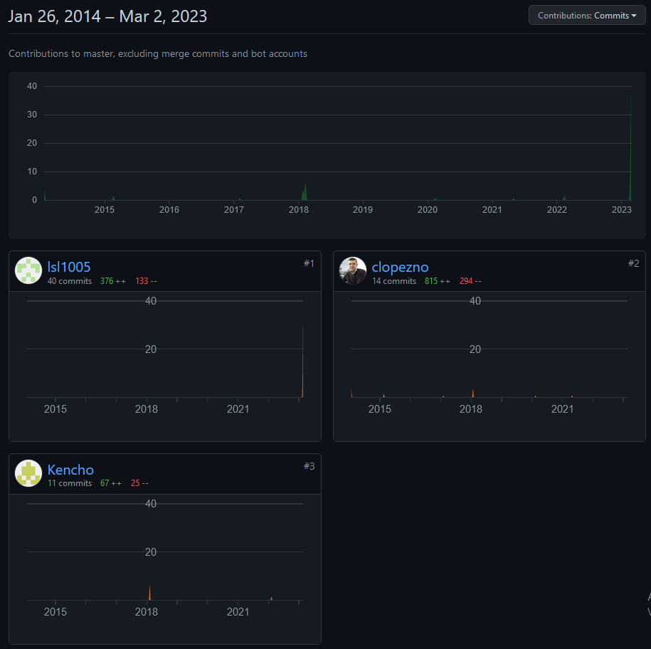
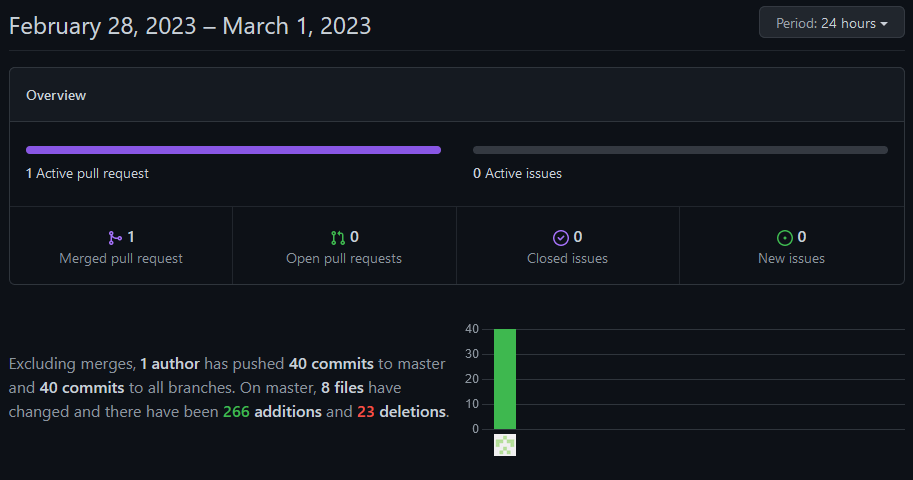
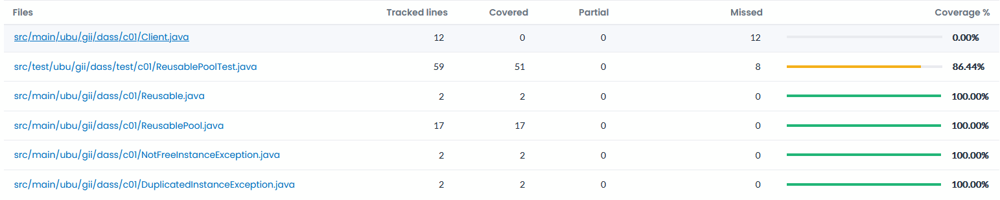
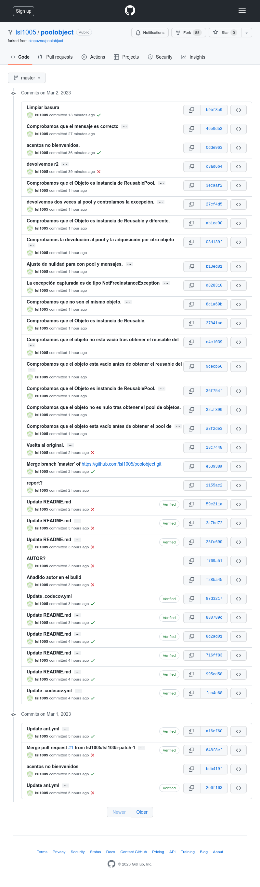
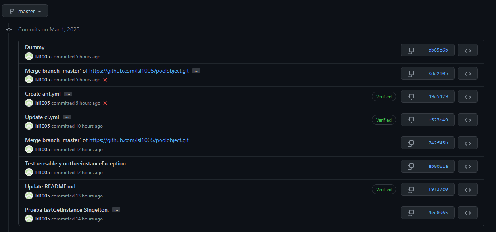

poolobject
==========

# Autores:

1. Juan Romera Pérez

2. Luis Sáez López

3. Álvaro Vázquez Suárez

# Objetivos específicos

- Comprender los objetivos de medición relacionados con la caracterización y la evaluación de productos, procesos y recursos software

- Comprender, aplicar y analizar técnicas de medición sobre entidades de productos software relacionados con conjuntos de pruebas de software

- Comprender, aplicar y analizar medidas relacionadas sobre entidades de proceso y recursos de prueba del software

# Enunciado:

En la práctica se va simular un pequeño desarrollo de un producto software para realizar mediciones sobre él.
El objetivo es establecer un caso de estudio que sirva para caracterizar y evaluar tanto el producto desarrollado como el proceso seguido.

## Descripción del producto

Dado un código de ejemplo del patrón diseño creacional Pool Object, se debe crear una batería de pruebas tal que las coberturas de sus clases sean del 100%. El código de las clases se puede obtener en el repositorio https://github.com/clopezno/poolobject. La batería de pruebas JUnit debe estar contenida en la clase ubu.gii.dass.test.c01.ReuseblePoolTest.java.

## Descripción del proceso

El proceso de desarrollo de la batería de pruebas se va a gestionar utilizando el control de versiones del sistema Git proporcionado por el repositorio de proyectos GitHub (https://github.com ). Los pasos para gestionar el procesos son los siguientes:

  1. Cada miembro del equipo tiene que estar registrado en GitHub, Travis CI (opcional se puede sustituir por Github actions) y Codecov.io.
  2. Uno de los miembros tiene que realizar un fork del repositorio donde se encuentra el código que se quiere probar https://github.com/clopezno/poolobject. El nuevo repositorio tiene que ser público.
  3. Invitar al resto de miembros del equipo para que puedan participar en el desarrollo del conjunto de pruebas.
  4. Vincular el proyecto con Travis CI(opcional) y Codecov.io.
  5. Cada nuevo test realizado ejecutar un commit/push al repositorio del grupo. El texto del commit tiene que describir el caso de prueba añadido.
  6. Verificar el resultado de las pruebas en el pipeline de integración continua y cómo la calidad del producto va mejorando con las sucesivas integraciones.

## Preguntas: (justificándolas con indicadores obtenidos a través de herramientas propuestas)

### ¿Se ha realizado trabajo en equipo?

Comprobamos los [commits](https://github.com/lsl1005/poolobject/commits/master) para ello.

### ¿Tiene calidad el conjunto de pruebas disponibles?

La función cliente solo contiene el main, por lo que no tiene sentido comprobar el método main.

De ReusablePoolTest solo quedan sin cubrir las excepciones o ausencia de las mismas.

Podemos ver que parte del código ha sido abarcada en las pruebas:

### ¿Cuál es el esfuerzo invertido en realizar la actividad?

Unas 7-8 horas.

### ¿Cuál es el número de fallos encontrados en el código?

A mi parecer, las pruebas unitarias no deberian depender de las pruebas anteriores, así que es un fallo usar una instancia estática.

# Conclusiones

Intentar hacer un readme.md dinámico con la información relativa a las preguntas ha llevado mucho tiempo.
Según la información vertida en la práctica y en el foro, travis era una opción gratiuta. No lo es. Ha llevado mucho tiempo comunicarse con la empresa.
No he querido indagar en los acentos por no abrir la caja de pandora, pero es chocante que no los admita. Quizá con quitar UTF-8 sea suficiente.

Desconocia la herramienta codecov.io. Me ha parecido muy interesante.
Ademas, he podido ver mientras buscaba la solución al readme dinámico que la se pueden configurar muchas acciones automáticas. De nuevo, muy interesante.
